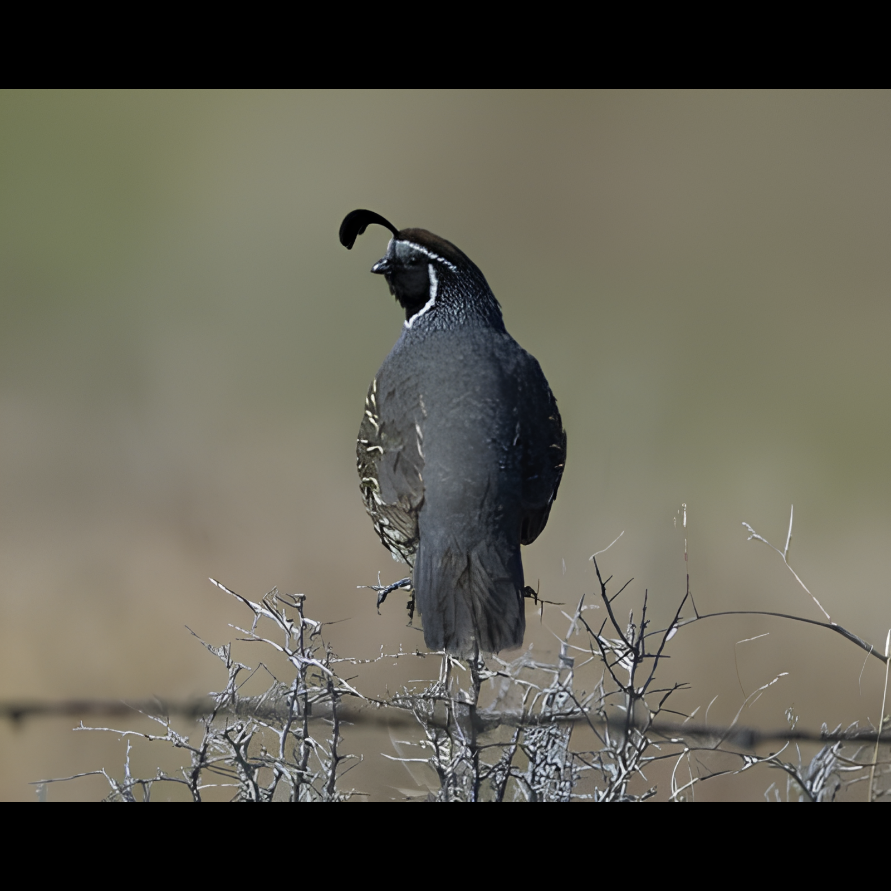
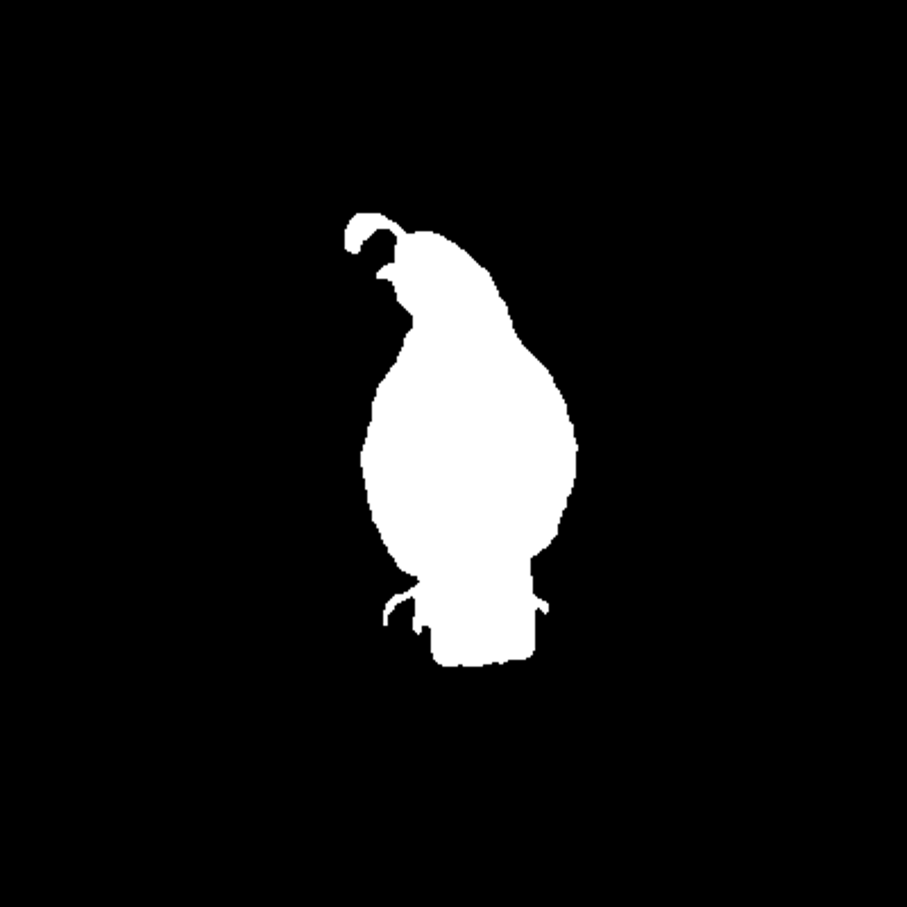
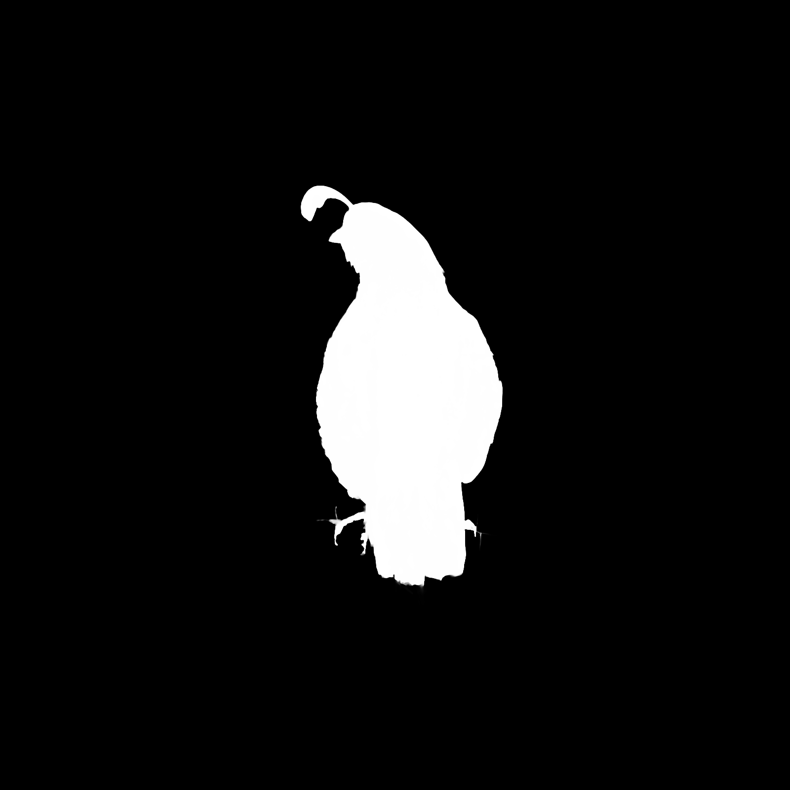
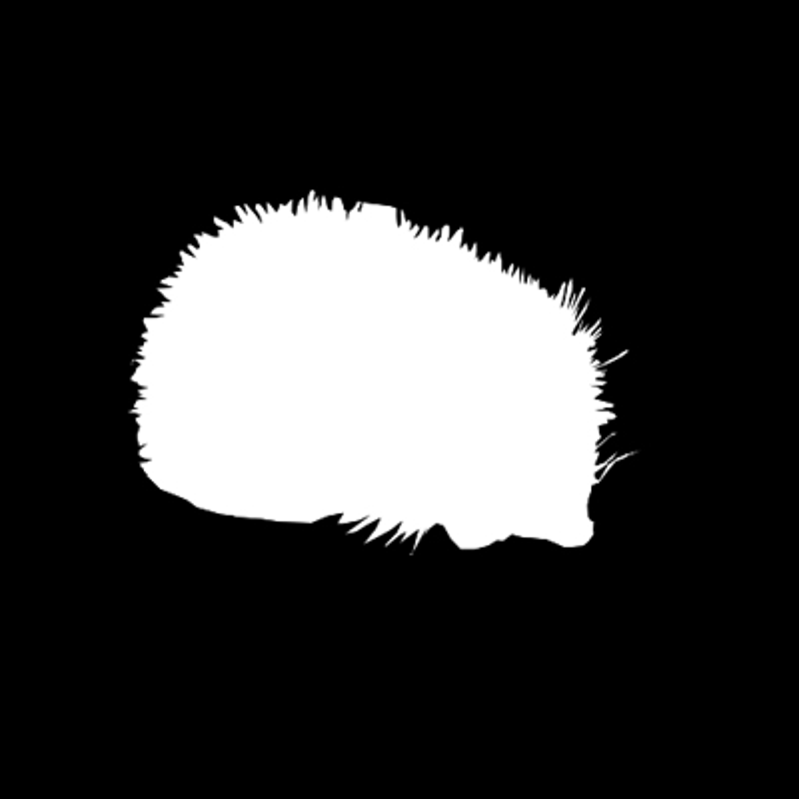
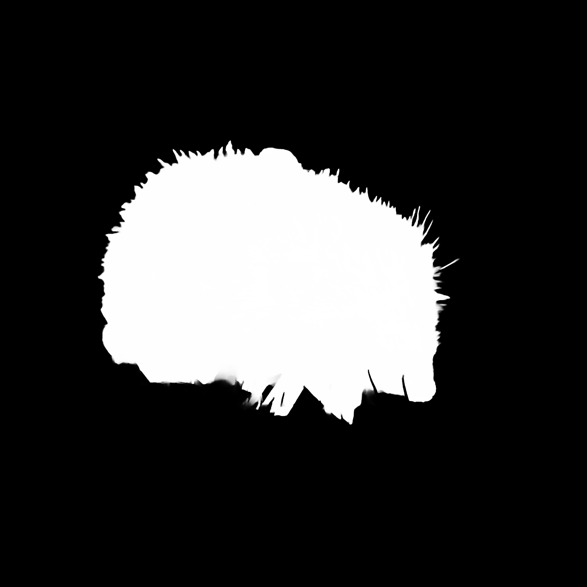
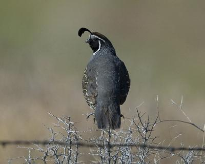
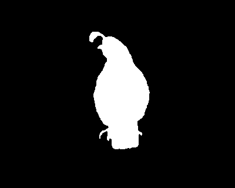
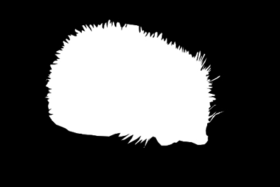

<p align="center">
  <h1 align="left">DUTS-HQ</h1>
</p>

HQ version of the [DUTS](http://saliencydetection.net/duts/) dataset for saliency detection, upscaled using [SwinIR](https://github.com/JingyunLiang/SwinIR) and refined by utilising [CascadePSP](https://github.com/hkchengrex/CascadePSP).

---

## Features
- All images are upscaled by 4x using ```003_realSR_BSRGAN_DFOWMFC_s64w8_SwinIR-L_x4_GAN.pth``` pretrained model
- The images are square padded to 1600x1600 with black borders and all masks upscaled using bicubic interpolation
- The masks are refined using [CascadePSP](https://github.com/hkchengrex/CascadePSP)
- This dataset **only** includes the DUTS train set and not the validation set
- The dataset contains the upscaled masks in the ```masks``` subdirectory and the processed masks in the ```hq-masks``` subdirectory
- All images are stored as PNG, 3 channel for the images and 1 channel for the masks

## Samples

<table>
  <tr>
    <td align="center">Image</td>
    <td align="center">Mask</td>
    <td align="center">HQ Mask</td>
   </tr>
  <tr>
    <td> </td>
    <td> </td>
    <td> </td>
   </tr>
  <tr>
    <td> </td>
    <td> </td>
    <td> </td>
   </tr>
</table>

### Original images
<table>
  <tr>
    <td align="center">Image</td>
    <td align="center">Mask</td>
   </tr>
  <tr>
    <td> </td>
    <td></td>
   </tr>
   <tr>
    <td> </td>
    <td></td>
   </tr>
</table>

## Download links
- TBD

## Warning
The refined masks aren't always perfect, but they are pretty good. There are a couple of quite noisy samples in the dataset, hence I included the original upscaled and padded masks in the dataset.

## Citation
```bibtex
@inproceedings{wang2017,
  title={Learning to Detect Salient Objects with Image-level Supervision},
  author={Wang, Lijun and Lu, Huchuan and Wang, Yifan and Feng, Mengyang 
  and Wang, Dong, and Yin, Baocai and Ruan, Xiang}, 
  booktitle={CVPR},
  year={2017}
}
```

```bibtex
@inproceedings{liang2021swinir,
    title={SwinIR: Image Restoration Using Swin Transformer},
    author={Liang, Jingyun and Cao, Jiezhang and Sun, Guolei and Zhang, Kai and Van Gool, Luc and Timofte, Radu},
    booktitle={IEEE International Conference on Computer Vision Workshops},
    year={2021}
}
```

```bibtex
@inproceedings{cheng2020cascadepsp,
  title={{CascadePSP}: Toward Class-Agnostic and Very High-Resolution Segmentation via Global and Local Refinement},
  author={Cheng, Ho Kei and Chung, Jihoon and Tai, Yu-Wing and Tang, Chi-Keung},
  booktitle={CVPR},
  year={2020}
}
```


## License and Acknowledgement
This dataset is based on the initial work of ```wang2017``` augmented using SwinIR by ```liang2021swinir``` and CascadePSP by ```cheng2020cascadepsp``` and follows their original licenses. 
